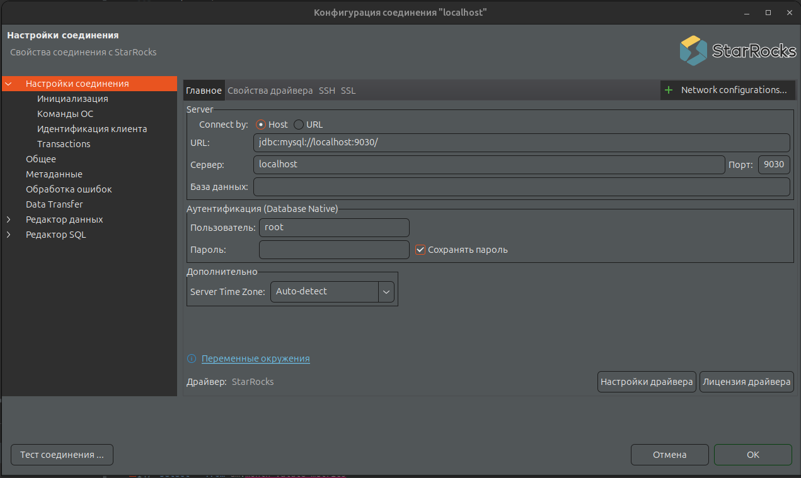
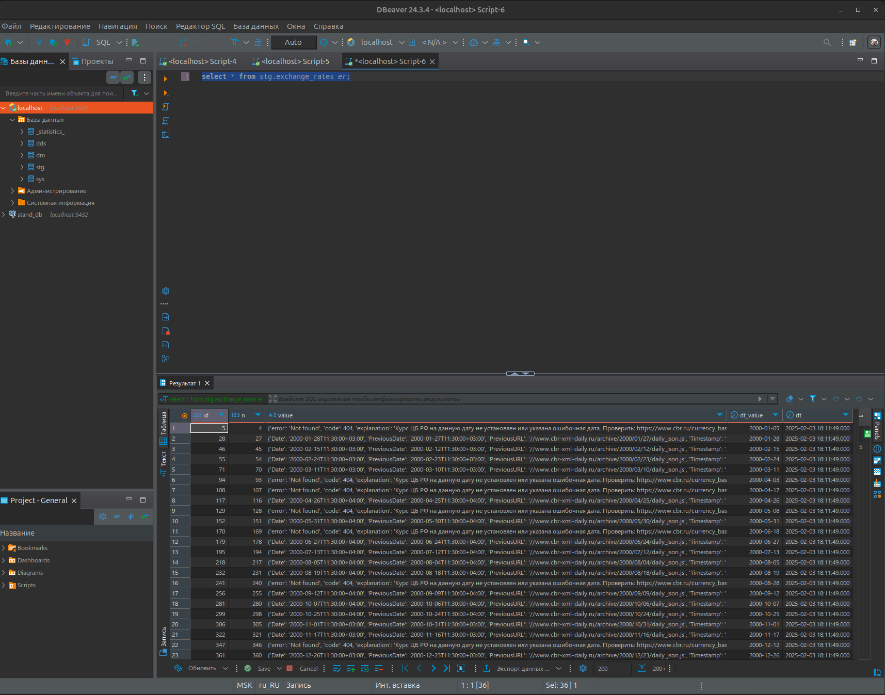
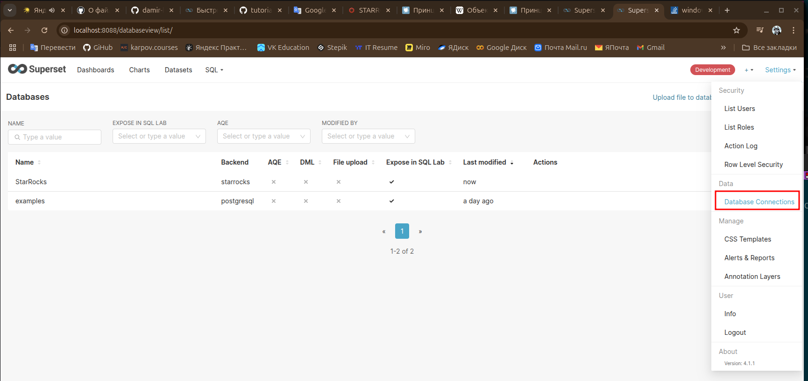
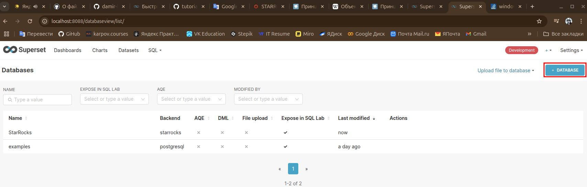
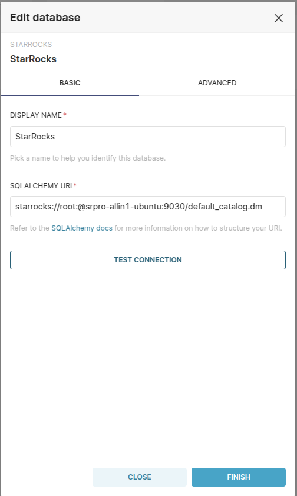
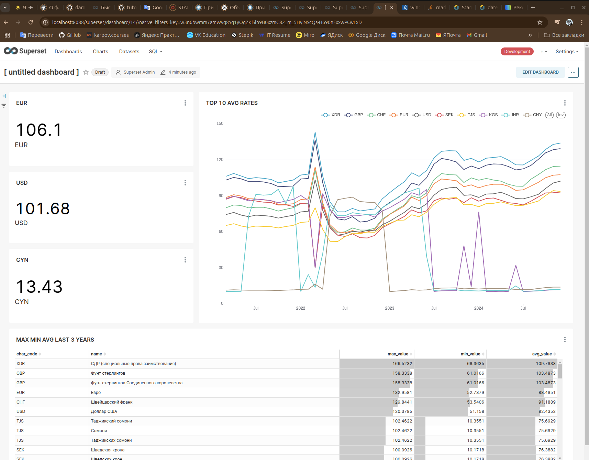

# starrocs_cb_rf
Данный проект создан для демонстрации MPP СУБД STARROCKS PRO и возможности работы совместно с Apache Superset.

## Содержание
- [Технологии](#технологии);
- [Deploy](#deploy);
- [Разработка](#разработка)

## Технологии
- [StarRocks Pro](https://starrockspro.ru/);
- [Apache Superset](https://superset.apache.org/);
- [DBeaver](https://dbeaver.io/);
- [GitHub](https://github.com/);
- [Docker](https://www.docker.com/).

## Deploy

Чтобы собрать стенд для работы и тестирования работы СУБД StarRocks Pro и Apache Superset у вас должны быть установлены следующие программные обеспечения:

- Git (установить командой ```sudo apt install git```);
- Docker и Docker compose ([инструкция по установке](https://docs.docker.com/engine/install/ubuntu/));
- DBeaver ([можно скачать инсталяционный файл](https://dbeaver.io/download/), либо установить командой ```sudo snap install dbeaver-ce```).

### Установка Apache Superset 

- Клонируете данный репозиторий:
<!--sec data-title="macOS и Linux" data-id="OSX_Linux_ls" data-collapse=true ces-->
```bash
git clone https://github.com/damir-kalin/starrocs_cb_rf.git
```
<!--endsec-->
- Перейдите в директорию проекта:
<!--sec data-title="macOS и Linux" data-id="OSX_Linux_ls" data-collapse=true ces-->
```bash
сd ./starrocs_cb_rf/
```
<!--endsec-->
- Для установки Apache Superset необходимо клонировать репозиторий с GitHub командой:
<!--sec data-title="macOS и Linux" data-id="OSX_Linux_ls" data-collapse=true ces-->
```bash
git clone https://github.com/apache/superset
```
<!--endsec-->
- Зайдите в директорию репозитория, который вы только что клонировали.
<!--sec data-title="macOS и Linux" data-id="OSX_Linux_ls" data-collapse=true ces-->
```bash
cd superset
```
<!--endsec-->
- Установите репозиторий в состояние, соответствующее последней официальной версии:
<!--sec data-title="macOS и Linux" data-id="OSX_Linux_ls" data-collapse=true ces-->
```bash
git checkout tags/4.1.1
```
<!--endsec-->
- Запустите Apache Superset с помощью Docker Compose:
<!--sec data-title="macOS и Linux" data-id="OSX_Linux_ls" data-collapse=true ces-->
```bash
docker compose -f docker-compose-image-tag.yml up
```
<!--endsec-->
- Выполните команду:

```bash
sudo docker exec -it superset_app superset fab create-admin \
               --username admin \
               --firstname Superset \
               --lastname Admin \
               --email admin@admin.com \
               --password admin; \
sudo docker exec -it superset_app superset db upgrade; \
sudo docker exec -it superset_app superset load_examples; \
sudo docker exec -it superset_app superset init;
sudo docker exec -it superset_app pip install --upgrade pip;\
sudo docker exec -it superset_app pip install mysqlclient;\
sudo docker exec -it superset_app pip install sqlalchemy-redshift;\
sudo docker exec -it superset_app pip install starrocks==1.0.6;
```

- Теперь перейдите по адресу http://localhost:8088 и войдите в систему, используя учетную запись:
```
username: admin
password: admin
```

### Установка StarRocks Pro

- Скачайте офциальную версию дистрибутива с сайта [StarRocks Pro](https://starrockspro.ru/).

- Сделайте файл исполняемым с помощью команды:
```bash
chmod +x srpro-allin1-setup
```
- Запустите установку командой:
```bash
sudo ./srpro-allin1-setup
````
Теперь StarRocks Pro запущен в вашей локальной машине на порту 9030.

- Подключите docker container со StarRocks Pro в сеть с Apache Superset командой:
```bash
docker network connect superset_default srpro-allin1-ubuntu 
```
Чтобы подключиться к StarRocks Pro в DBeaver необходимо заполнить поля для подключения как на скриншоте:
<p align="center">

</p>

## Разработка

- Создаем слои в нашем хранилище:
```SQL
CREATE DATABASE stg;
CREATE DATABASE dds;
CREATE DATABASE dm;
```
- Создаем таблицу для сырых данных в слое stg:
```SQL
CREATE TABLE stg.exchange_rates(
	id bigint NOT NULL AUTO_INCREMENT COMMENT "ID",
	n int COMMENT "Number row in file",
	value string COMMENT "Data about rates",
	dt_value date COMMENT "Date parse",
	dt datetime NOT NULL DEFAULT CURRENT_TIMESTAMP COMMENT "Date and time download"
)
ENGINE=OLAP
PRIMARY KEY(id)
DISTRIBUTED BY HASH(id);
```
- Создаем ассинхронные материализованные представления в слое dds:
```SQL
CREATE MATERIALIZED VIEW dds.d_valute
DISTRIBUTED BY HASH(`hk_valute`)
REFRESH ASYNC START('2025-02-03 21:00:00') EVERY (INTERVAL 1 DAY)
AS 
SELECT 
	DISTINCT
    MURMUR_HASH3_32(REPLACE(value -> 'CharCode', '\"', '')) AS hk_valute,
	REPLACE(value -> 'ID', '\"', '') AS id_valute,
	REPLACE(value -> 'CharCode', '\"', '') AS char_code,
	REPLACE(value -> 'Name', '\"', '') AS name,
	CAST(REPLACE(value -> 'Nominal', '\"', '') AS INT) AS nominal,
	CAST(REPLACE(value -> 'NumCode', '\"', '') AS INT) AS num_code
FROM (
	SELECT 
		PARSE_JSON(REPLACE(value, '\'', '\"'))->'Valute' AS valute
	FROM stg.exchange_rates 
	WHERE value NOT LIKE '%error%'
) AS K, LATERAL JSON_EACH(valute) AS T;
```
```SQL
CREATE MATERIALIZED VIEW dds.f_exchange_valute
DISTRIBUTED BY HASH(`hk_valute`)
REFRESH ASYNC START('2025-02-03 21:00:00') EVERY (INTERVAL 1 DAY)
AS 
SELECT 
	D.hk_valute AS hk_valute,
	S.dt_value AS date,
	S.value,
	S.previous	
FROM (
    SELECT 
        REPLACE(value -> 'CharCode', '\"', '') AS char_code,
        CAST(REPLACE(value -> 'Previous', '\"', '') AS NUMERIC(10,4)) AS previous,
        CAST(REPLACE(value -> 'Value', '\"', '') AS NUMERIC(10,4)) AS value,
        dt_value
    FROM (
            SELECT 
                PARSE_JSON(REPLACE(value, '\'', '\"'))->'Valute' AS valute,
                dt_value
            FROM stg.exchange_rates 
            WHERE value NOT LIKE '%error%'
        ) AS K, LATERAL JSON_EACH(valute) AS T
    ) AS S
INNER JOIN dds.d_valute D ON S.char_code = D.char_code;
```
- Для вставки данных в stg слой необходимо зайти в директорию где находится файл exchange_rates.csv в командной строке:
```bash
cd ./source
```
- Выполняем команду для вставки данных в stg слой:
```bash
curl --location-trusted -u root:12345 -H "label:123" \
    -H "Expect:100-continue" \
    -H "column_separator:," \
    -H "skip_header:1" \
    -H "enclose:\"" \
    -H "columns: n, value, dt_value" \
    -T exchange_rates.csv -XPUT \
    http://localhost:8030/api/stg/exchange_rates/_stream_load
``` 
- Проверяем наличие данных в слое stg:
```sql
SELECT * FROM stg.exchange_rates er;
```
<p align="center">

</p>

- Переходим в браузере на http://localhost:8088, входим под пользователем admin в Apache Superset.
- Переходим в раздел Settings, затем в Database Connections.
<p align="center">

</p>
- Нажимаем на кнопку +DATABASE.
<p align="center">

</p>
- Добавляем соединение.

```
starrocks://root:@srpro-allin1-ubuntu:9030/default_catalog.dm
```
<p align="center">

</p>

- Нажимаем TEST CONNECTION. При успешном соединении нажимаем FINISH.
- Теперь можем творить в Superset.
- Пример дашборда в Apache Superset:

<p align="center">

</p>
